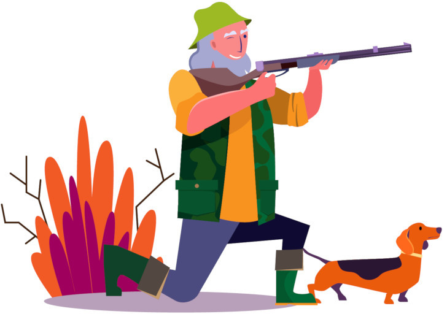

  

<h1 align="center">Cazdata</h1>
<h3 align="center">Mobile application for tracking hunting activities</h3>

  
  

# Cazdata

This repository is one of the activities of the [Free Software Club from the University of Córdoba](https://uco.es/aulasoftwarelibre).

## About the project

TBA
